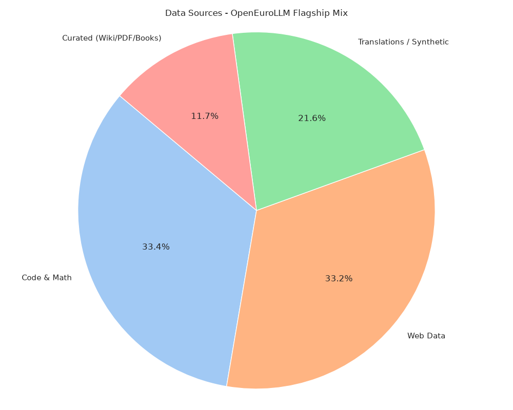
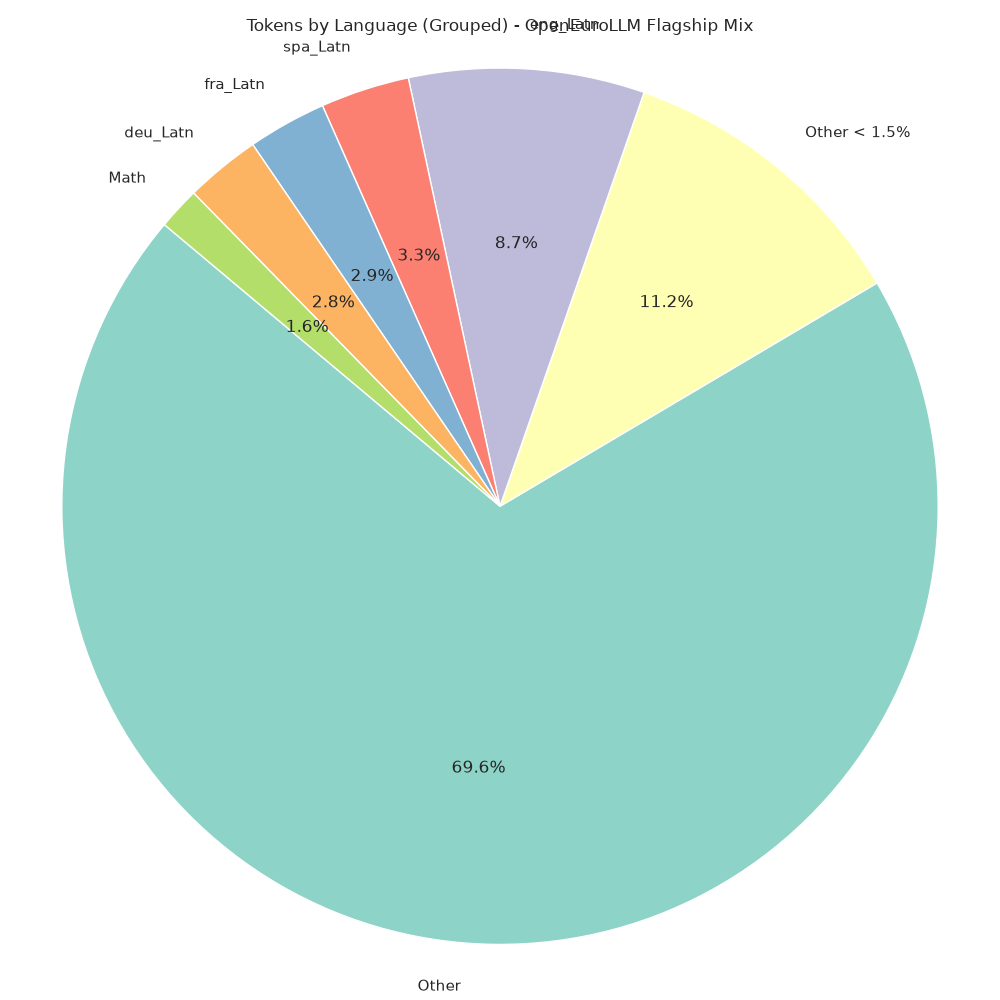
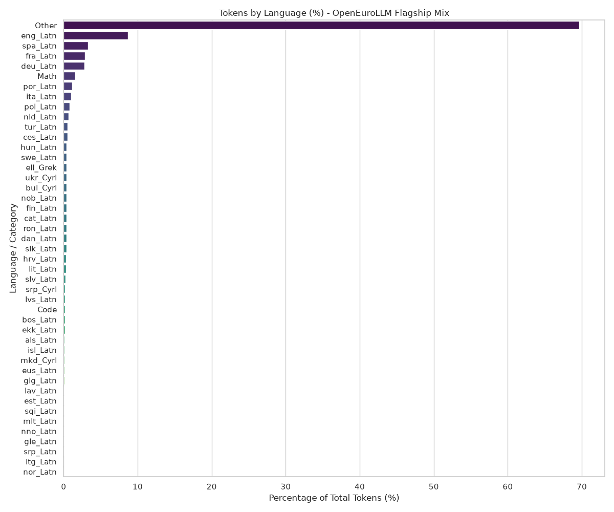
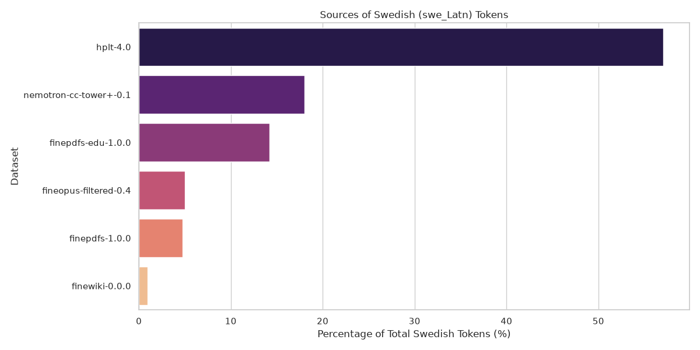
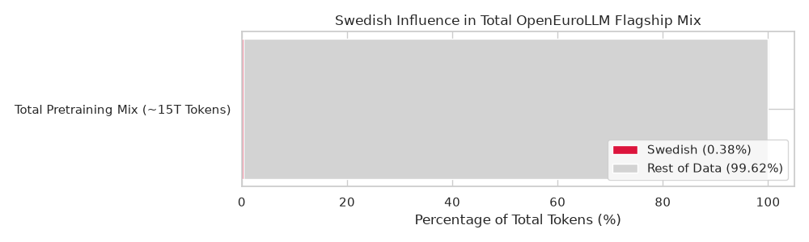

# OpenEuroLLM Token Counts

This repository contains the token counts and language distribution analysis for the total flagship mix trained in OpenEuroLLM. 

## Overview

The analysis extracts language information and categorizes the tokens from the `counts.csv` dataset. The script computes the percentages of the total tokens for each language and groups the datasets into broader data sources.

### Key Findings
- **Language Distribution:** **English** (`eng_Latn`) constitutes approximately **66.5%** of the entire mix. Combined with **Math** (11.3%) and **Code** (2.2%), this forms exactly 80% of the dataset, matching our expectations. 
- **Top European Languages:** Following English, the most prominent languages are **Spanish** (`spa_Latn`), **French** (`fra_Latn`), and **German** (`deu_Latn`).
- **Swedish Deep Dive:** The Swedish (`swe_Latn`) tokens are primarily sourced from **hplt-4.0** and **nemotron-cc-tower+-0.1** (multisynt machine translations), alongside smaller curated PDF and Wiki sets.
- **Data Sources:** The token volume is heavily driven by Web Data and robust Code & Math mixes, with translations/synthetic data like `multisynt` (Tower/Opus) and Curated datasets forming the rest.

## Visualizations

### 1. Token Distribution by Source Type


### 2. Tokens by Language (Grouped)
*(Languages with <1.0% of the total tokens are grouped into "Other < 1.0%")*


### 3. Tokens by Language (Bar Chart)


### 4. Sources of Swedish Tokens (`swe_Latn`)


### 5. Swedish Influence in Total Mix
To visualize how small the total Swedish component is relative to the entire 15TT pretraining mix (illustrating the negligible impact of small Swedish datasets):


## Running the Analysis

The analysis script uses `polars` for fast data processing and `seaborn`/`matplotlib` for visualization.

To run the script:

```bash
# Ensure dependencies are installed (e.g. using uv)
uv sync

# Run the analysis
uv run python src/analyze.py
```

## Testing

A `pytest` suite is included to verify the language extraction logic. Run tests with:

```bash
PYTHONPATH=. uv run pytest tests/
```
